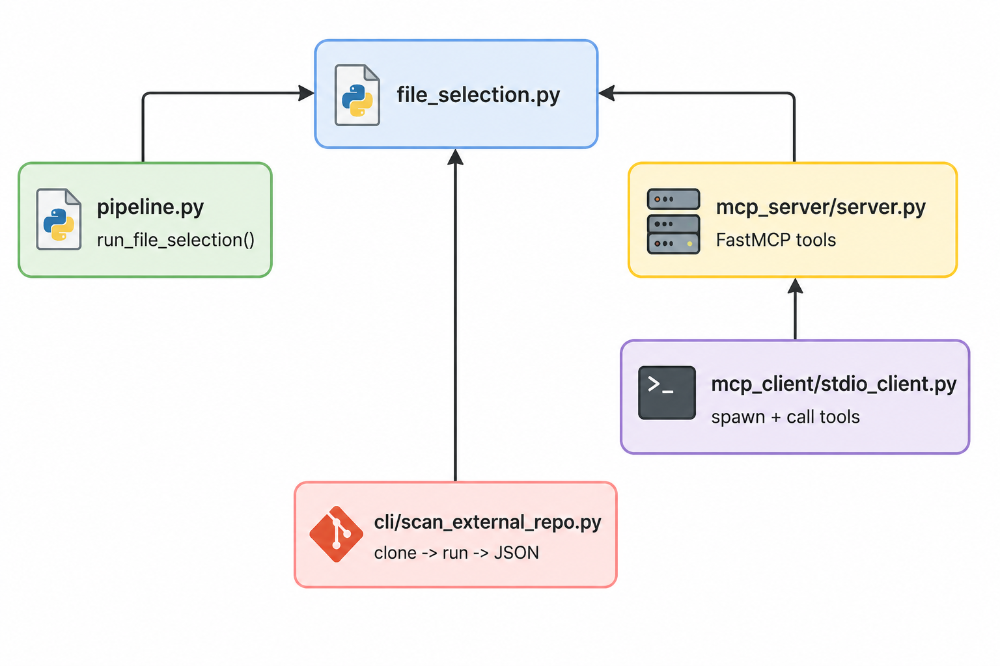

# Documentation 01: File selection + MCP plumbing (v0.1)

## Scope of this prototype

This prototype implements the first “vertical slice” needed for later practice/smell detection:

- **File selection** for ML/agentic codebases  
Scan a repository, bucket files, and rank likely ML-relevant files.
- **MCP integration (stdio)**  
Expose the same capabilities as **MCP tools** so they can be called from an MCP host.
- **Reproducible test story**  
Unit tests (pytest), MCP smoke test, and a script to scan a real GitHub repository (clone → run → save JSON → cleanup).

It intentionally does **not** implement practice detection yet (PR2/PR6/PR8 etc. are tracked in `docs/CATALOG.md` for the next milestone).

---

## Repository layout

```text
agentic_insight_prototype/
├── README.md
├── pyproject.toml
├── src/insight_proto/
│   ├── tools/file_selection.py          # scan, categorize, rank, exclude
│   ├── orchestrator/pipeline.py         # in-process pipeline wrapper
│   ├── mcp_server/server.py             # FastMCP tools over stdio
│   ├── mcp_client/stdio_client.py       # spawn server + smoke test calls
│   └── cli/scan_external_repo.py        # clone remote repo, run pipeline, write JSON
├── scripts/run_external_scan.sh         # convenience wrapper
└── tests/test_file_selection.py
```

---

## Core idea: one engine, multiple interfaces

All selection logic lives in **one module**:

- `src/insight_proto/tools/file_selection.py`

Everything else is either:

- a thin **pipeline wrapper** (`orchestrator/pipeline.py`),
- an **MCP tool wrapper** (`mcp_server/server.py`),
- or a **test / CLI entry point**.

---


---

## Installation

```bash
cd agentic_insight_prototype
python3 -m venv .venv
source .venv/bin/activate
pip install -e ".[dev]"
```

---

## How to run (three common workflows)

### 1) Unit tests

```bash
pytest -q
```

### 2) In-process pipeline (no MCP)

```bash
python -c "from insight_proto.orchestrator.pipeline import run_file_selection; import json; print(json.dumps(run_file_selection('.'), indent=2))"
```

### 3) MCP smoke test (client spawns server)

```bash
insight-mcp-client .
```

---

## MCP server details

### Run the server (stdio transport)

```bash
insight-mcp-server
```

In stdio mode, the server **waits for MCP messages on stdin**, so it will not exit on its own. Logging is written to **stderr** to avoid corrupting the protocol stream.

### Tools exposed

- `health_check`
- `scan_repository(root, extensions=".py")`
- `categorize_files(root, extensions=".py")`
- `filter_ml_relevant_files(root, extensions=".py", min_score=0.15, exclude="")`

`exclude` is a comma-separated list such as `tests,examples`.

---

## Scan a real GitHub repository (recommended sanity check)

This uses a shallow clone to keep the test fast, saves a JSON report, and removes the clone by default.

```bash
insight-scan-external-repo \
  --url https://github.com/huggingface/trl.git \
  -o artifacts/trl_scan.json
```

If `-o` is omitted, the default output location is `results/scan_results.json`.

Exclude tests and examples (often useful):

```bash
insight-scan-external-repo \
  --url https://github.com/huggingface/trl.git \
  -o artifacts/trl_core.json \
  --exclude tests,examples
```

If you want to inspect the cloned repo folder under `/tmp`, add:

```bash
insight-scan-external-repo --no-cleanup
```

---

## Outputs

The scan produces a JSON object with:

- `scan_count`: number of scanned files (currently counting `.py`)
- `categories`: file buckets
- `ml_ranked`: ranked list of `{path, score}`
- `ml_ranked_count`

---

## Next steps (planned)

The next milestone is to implement a first practice/smell detection pass on top of the selected file set (tracked in `docs/CATALOG.md`), and then add validation gates / logging improvements.